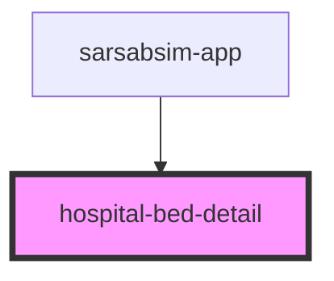

# hospital-bed-detail

<!-- Auto Generated Below -->

## Properties

| Property  | Attribute  | Description | Type     | Default     |
| --------- | ---------- | ----------- | -------- | ----------- |
| `apiBase` | `api-base` |             | `string` | `undefined` |
| `bedId`   | `bed-id`   |             | `string` | `undefined` |

## Events

| Event  | Description | Type                |
| ------ | ----------- | ------------------- |
| `back` |             | `CustomEvent<void>` |

## Dependencies

### Used by

 - [sarsabsim-app](../sarsabsim-app)

### Graph

----------------------------------------------

*Built with [StencilJS](https://stenciljs.com/)*
