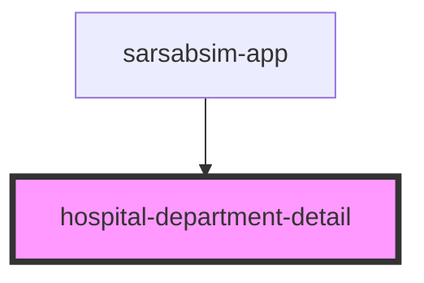

# hospital-department-detail

<!-- Auto Generated Below -->

## Properties

| Property       | Attribute       | Description | Type     | Default     |
| -------------- | --------------- | ----------- | -------- | ----------- |
| `apiBase`      | `api-base`      |             | `string` | `undefined` |
| `departmentId` | `department-id` |             | `string` | `undefined` |

## Events

| Event         | Description | Type                  |
| ------------- | ----------- | --------------------- |
| `back`        |             | `CustomEvent<void>`   |
| `bedSelected` |             | `CustomEvent<string>` |

## Dependencies

### Used by

 - [sarsabsim-app](../sarsabsim-app)

### Graph

----------------------------------------------

*Built with [StencilJS](https://stenciljs.com/)*
