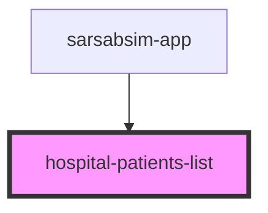

# hospital-patients-list

<!-- Auto Generated Below -->

## Properties

| Property  | Attribute  | Description | Type     | Default     |
| --------- | ---------- | ----------- | -------- | ----------- |
| `apiBase` | `api-base` |             | `string` | `undefined` |

## Events

| Event             | Description | Type                  |
| ----------------- | ----------- | --------------------- |
| `patientSelected` |             | `CustomEvent<string>` |

## Dependencies

### Used by

 - [sarsabsim-app](../sarsabsim-app)

### Graph

----------------------------------------------

*Built with [StencilJS](https://stenciljs.com/)*
